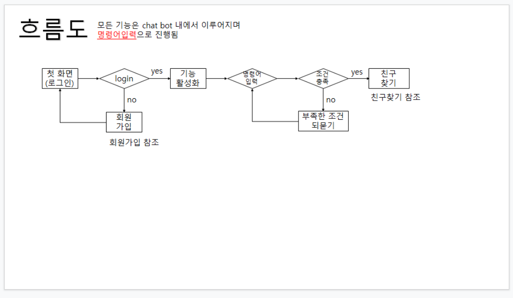
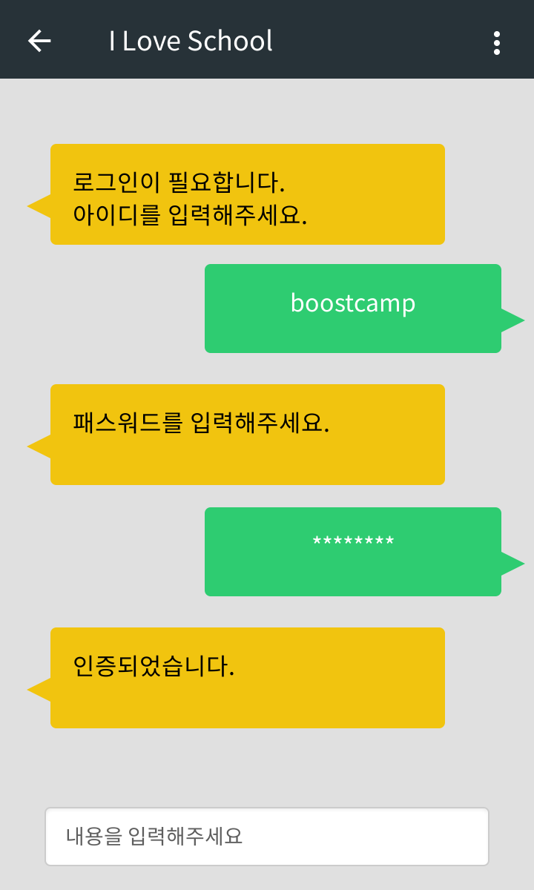

# 1주차 - 릴레이 프로젝트 기획서

## 1. 7/31 릴레이프로젝트 18팀 회의 내용 정리

지난 회의에서 **'아이러브스쿨'**을 목표 서비스로 선정.

이번 회의에서는 자연어 처리, 비전/영상 처리, 테이블 값 데이터의 기술별로 적용할 기능을 정함. 이후 4인 1조, 총 세 팀으로 나누어 기능 기획 문서를 작성하기로 함.

*세부적인 구현 방법, UI 등은 해당 디렉토리의 각 기능별 기능 기획서를 참고해주시기 바랍니다.*

* **자연어 처리 기술에서 제안된 의견**
    
    * 음성 인식을 통한 친구 추천 기능 (ex: ○○초 출신 친구 추천해줘)
    * 검색창의 오타 교정에 적용 (ex: □□고, □□고등학교, □□ 고등학교 등의 입력을 일괄적으로 처리)
* 챗봇 형식으로 도입 (회원가입, 친구 추가 등의 기능 안내)
    
    **✅ 이 중 챗봇 형식으로 도입을 채택**
    
*  **비전/영상 처리 기술에서 제안된 의견**

    * 회원가입 시 신분증/학생증/졸업장 등의 사진을 제출해 신분 인증
    * 회원가입 시 신분증의 위치 정보를 받아 위치 정보 인증

        **✅ 이 중 신분증을 통한 신분 인증 채택**

        단, 개인정보보호를 위해 주민등록번호 뒷자리는 모자이크처리 후 사진을 업로드하도록 안내함.

*  **테이블 값 데이터 처리 기술에서 제안된 의견**

    * 같은 학교 출신 간 친구 추천 기능만이 제안됨

        **✅ 해당 기능으로 채택**

## 2. 기능기획

### 2-1) A기능 개발 - 자연어 처리(챗봇 대화 시스템 개발)

**기능 소개**

명령어 입력시 다음 기능이 수행되도록 구현한다.

* 로그인 

  * 첫 접속시 로그인 상태가 아니면 로그인 메세지를 보여준다.
  * 또는 "로그인"을 입력하면 로그인을 진행한다.
  * "아이디를 입력하세요" 라는 메세지가 나오면 아이디를 입력받는다.
  * "패스워드를 입력하세요" 라는 메세지가 나오면 패스워드를 입력받는다.
  * 패스워드는 가림표시(***) 해서 보여준다.
  * 인증에 성공시 "인증되었습니다." 라는 메세지를 보여준다.
  * 인증에 실패시 "아이디나 비밀번호가 틀렸습니다." 라는 메세지를 보여준다.

* 회원가입

  * 명령어: 회원가입 할래, 회원가입 할께 등등..
  * 동작: 회원가입 폼을 보여준다. (3주차 회원가입 단계에서 이후 동작 구현)

* 친구찾기

  * 명령어: OO고 졸업한 친구 추천해줘 등
  * 동작: 친구찾기 폼을 보여준다. (4주차 친구찾기 구현 단계에서 이후 동작 구현)

**Flow**

**Sample**

### 2-2) B기능 개발 - 비전/영상처리 기능 기획

**Flow**

플로우차트는 다음과 같다.

회원가입시 본인 인증 수단으로 주민등록증 이미지를 받아 인증을 처리한다. 

회원가입 창을 들어가게 되면 먼저 본인 인증을 위한 민증을 입력받는 화면이 뜨도록 하며 건너뛰기를 통하여 생략할 수 있다. 

---

두가지 방법에 따라 회원가입시 직접 입력할 정보가 달라진다. 

* **본인인증을 할 경우**

  민증의 이름과 나이 정보를 받아와 회원가입 창의 이름과 나이에 값을 넣고 다른 정보들은 직접 기입한다.

* **본인인증을 하지 않을 경우** 

  모든 요구 정보를 직접 기입한다.

---

* **인증 이유**

  실명, 본인확인을 통해 광고성 또는 불법 게시글 작성을 차단할 수 있다. 

  직접 치는 귀찮음을 영상인식으로 처리할 수 있다.

* **요구 정보**

  본인 인증 창에서 요구되는 정보 : 뒷자리를 가린 주민등록증 사진

  회원가입 창에서 요구되는 정보 : ID, PW, 이름, 나이, 출신학교 

  (이외에 필요하시면 전화번호, 이메일 등의 정보를 추가로 받아도 됩니다!)

---

**레이아웃**

대략적인 틀입니다.

레이아웃은 마음대로 바꿔도 됩니다. 요구되는 정보만 들어가면 됩니다!

* **민증 입력 레이아웃**

* **회원가입 레이아웃 예시**

**참고하면 좋을 API**

* **Google Vision API**

  https://cloud.google.com/vision/docs/ocr?hl=ko (공식 문서)

  https://jungwoon.github.io/google%20cloud/2018/01/09/Vision-Api/ (참고 자료)

* **OpenCV**

  https://leembedded.tistory.com/26 (이미지 전처리 참고 자료)

### 2-3) C 기능 개발 - 테이블 값 데이터

  * 미션1 : 입력한 데이터를 기반으로 ML을 사용하여 친구를 추천해주는 기능을 구현한다.

    * ex) 	

            input 	: 부캠고, 김부트, 김네버   
            
            output 	: 김부트, 김네버, 박그린

    ​        

            input  	: 부캠고
          
            output	: 김웹툰, 김클라, 김우드

    * 로직 :

      * 1. 사용자로부터 학교, 친한친구(최대 3명)에 대한 정보를 받는다. (학교, 친한 친구 이름)

      * 2. 친한 친구를 우선순위로 두어 친구 추천 5명을 진행

      * 3. 작성한 친한 친구 수가 3명이하 일 경우 같은 나이(빠른년생일 경우 감안), 같은 학교로 등록되어 있는 친구 순서로 추천

         * 1. 이 과정에서 ML을 이용하여 친구 추천기능을 구현한다. 
         * 2. 따로 db는 구현하지않고 json파일에 임의의 친구들을 저장해두어 테스트를 진행한다.

      * 4. 나온 결과를 사용자에게 제공한다. 

    * 참고 오픈소스 : (https://github.com/junku901/machine_learning)

  * 미션2 : A 기능에 개발한 챗봇 시스템과 연결시키기

    * 로직 :
      * 1. “친구”, “추천” 과 같은 입력을 받았을 때, 챗봇이 C 기능 로직 1번에 있는 입력을 챗봇UI에서 입력받는다.
      * 2. 이후 나온 결과를 챗봇 output으로 사용자에게 제공한다.

## 참여자

**1주차 - 기획**

J206-최정은, J207-최준식, J208-최진혁, J209-최창희, J210-최홍일, J211-탁성건,

J212-하이현, J213-하지수, J214-한상욱, J215-한승래, J216-한예지, J217-한종호

**2주차 - A기능 개발**

J037-김민지, J073-박기호, J109-안샛별, J110-안소희, J148-이수경

J186-정수원, J036-김민식, J074-박동현, J184-정상우, J223-김병국

**3주차 - B기능 개발**

**4주차 - C기능 개발**
